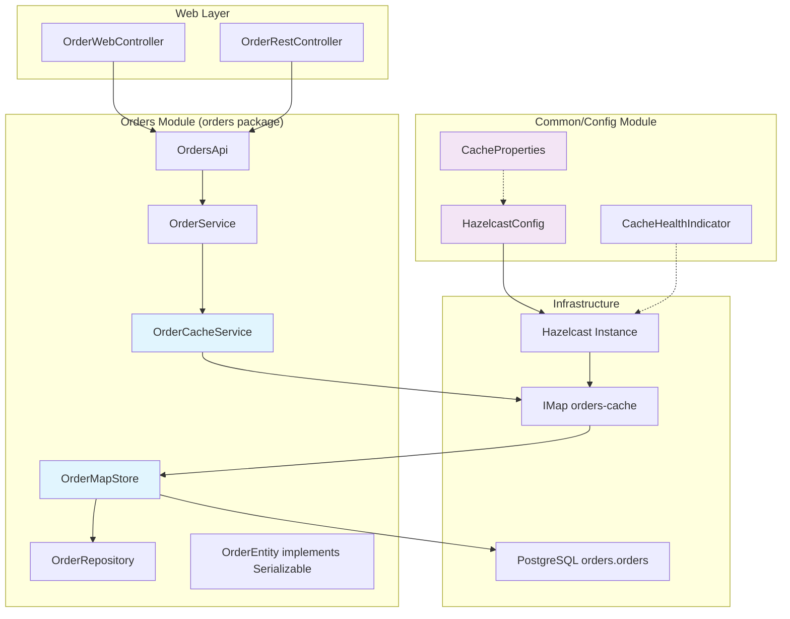
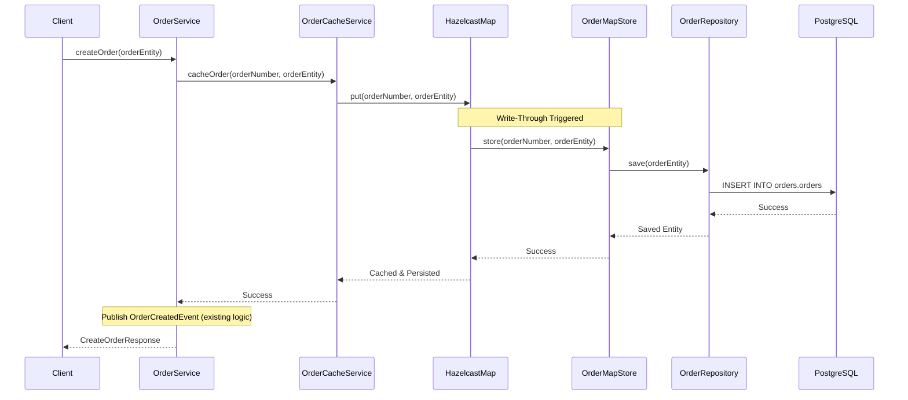

# Design Document

## Overview

本設計文件詳細說明如何將 Hazelcast 快取機制整合到現有的 Spring Boot 模組化單體應用程式中，特別針對 Orders 模組實作 write-through 快取策略。設計完全遵循 Spring Modulith 的模組邊界，並充分利用 Spring Boot 的自動配置機制。

## Steering Document Alignment

### Technical Standards (tech.md)
由於沒有現有的 tech.md 文件，本設計嚴格遵循以下技術標準：
- **Spring Boot Auto-Configuration**: 使用 `@EnableHazelcast` 和 Spring Boot 的 Hazelcast 自動配置
- **Spring Modulith Boundaries**: 快取配置放在 common 模組，Orders 快取實作保持在 orders 模組內
- **Transaction Integration**: 快取操作與現有的 `@Transactional` 方法無縫整合
- **Event-Driven Architecture**: 保持現有的 `OrderCreatedEvent` 發布機制

### Project Structure (structure.md)
遵循現有的 Spring Modulith 模組結構：
- 全域配置：`com.sivalabs.bookstore.config.HazelcastConfig`
- Orders 快取：`com.sivalabs.bookstore.orders.cache.*`
- 配置屬性：`com.sivalabs.bookstore.config.CacheProperties`
- 測試保持模組隔離：使用 `@ApplicationModuleTest`

## Code Reuse Analysis

### Existing Components to Leverage
- **OrderEntity**: 擴展為 `implements Serializable`，直接作為快取物件，無需包裝類別
- **OrderService**: 透過依賴注入整合快取服務，保持現有業務邏輯不變
- **OrderRepository**: MapStore 直接注入並使用，避免重複的資料庫連線
- **Spring Boot DataSource**: 重用現有的 HikariCP 配置和連線池
- **Spring Modulith Events**: 快取操作不影響現有的事件發布機制

### Integration Points
- **OrderService 方法增強**: 使用 Spring AOP 或服務層封裝整合快取
- **Spring Boot Actuator**: 整合健康檢查和指標監控
- **Application Properties**: 擴展現有的 `application.properties` 配置模式
- **Flyway Migration**: 不需要資料庫變更，但添加快取相關配置參數
- **Testing Framework**: 整合現有的 `@ApplicationModuleTest` 和 TestContainers

## Architecture

### System Architecture with Module Boundaries



### Write-Through Operation Flow



### Modular Design Principles
- **Single File Responsibility**: 配置、MapStore、快取服務、錯誤處理各自獨立
- **Component Isolation**: 快取功能透過介面抽象，支援不同實作
- **Service Layer Separation**: 快取邏輯不污染 OrderService 的業務邏輯
- **Module Boundary Respect**: 快取實作完全在 orders 模組內，配置在 common 模組

## Components and Interfaces

### HazelcastConfig (Global Configuration)
- **Purpose:** Spring Boot 自動配置 Hazelcast 實例和快取地圖
- **Interfaces:** `@Configuration`, `@EnableHazelcast`
- **Dependencies:** CacheProperties, Spring Boot Auto-Configuration
- **Reuses:** Spring Boot 的配置模式和自動配置機制

```java
@Configuration
@EnableHazelcast
@EnableConfigurationProperties(CacheProperties.class)
public class HazelcastConfig {
    
    @Bean
    public Config hazelcastConfig(CacheProperties cacheProperties) {
        // 使用 Spring Boot 模式配置 Hazelcast
    }
    
    @Bean
    public IMap<String, OrderEntity> ordersCache(HazelcastInstance hazelcast) {
        return hazelcast.getMap("orders-cache");
    }
}
```

### OrderMapStore (Write-Through Implementation)
- **Purpose:** 實作 write-through 模式，整合現有的 OrderRepository
- **Interfaces:** `MapStore<String, OrderEntity>`, `MapLoaderLifecycleSupport`
- **Dependencies:** OrderRepository (注入現有實例)
- **Reuses:** 完全重用現有的 OrderRepository 和資料庫連線

```java
@Component
public class OrderMapStore implements MapStore<String, OrderEntity>, MapLoaderLifecycleSupport {
    
    private final OrderRepository orderRepository;
    
    @Override
    public void store(String orderNumber, OrderEntity order) {
        orderRepository.save(order);
    }
    
    @Override
    public OrderEntity load(String orderNumber) {
        return orderRepository.findByOrderNumber(orderNumber).orElse(null);
    }
}
```

### OrderCacheService (Cache Abstraction)
- **Purpose:** 封裝快取操作，提供故障安全的快取服務
- **Interfaces:** 快取 CRUD 操作介面
- **Dependencies:** Hazelcast IMap, CacheErrorHandler
- **Reuses:** 現有的錯誤處理和日誌模式

```java
@Service
public class OrderCacheService {
    
    private final IMap<String, OrderEntity> ordersCache;
    private final CacheErrorHandler errorHandler;
    
    public Optional<OrderEntity> findByOrderNumber(String orderNumber) {
        // 實作快取查詢邏輯
    }
    
    public void cacheOrder(String orderNumber, OrderEntity order) {
        // 實作快取寫入邏輯（觸發 write-through）
    }
}
```

### Enhanced OrderService (Service Layer Integration)
- **Purpose:** 最小化修改現有 OrderService，透過快取服務增強
- **Interfaces:** 保持現有的公開介面完全不變
- **Dependencies:** 新增 OrderCacheService 依賴
- **Reuses:** 100% 保留現有的業務邏輯、事務管理和事件發布

```java
@Service
public class OrderService {
    
    private final OrderRepository orderRepository;
    private final OrderCacheService cacheService; // 新增
    private final ApplicationEventPublisher eventPublisher;
    
    @Transactional
    public OrderEntity createOrder(OrderEntity orderEntity) {
        OrderEntity savedOrder = orderRepository.save(orderEntity);
        
        // 快取新創建的訂單（write-through）
        cacheService.cacheOrder(savedOrder.getOrderNumber(), savedOrder);
        
        // 保持現有的事件發布邏輯
        OrderCreatedEvent event = new OrderCreatedEvent(/*...*/);
        eventPublisher.publishEvent(event);
        
        return savedOrder;
    }
    
    @Transactional(readOnly = true)
    public Optional<OrderEntity> findOrder(String orderNumber) {
        // 先嘗試從快取讀取
        Optional<OrderEntity> cached = cacheService.findByOrderNumber(orderNumber);
        if (cached.isPresent()) {
            return cached;
        }
        
        // 快取未命中，從資料庫讀取
        return orderRepository.findByOrderNumber(orderNumber);
    }
}
```

### CacheProperties (Configuration Properties)
- **Purpose:** Spring Boot 配置屬性，支援不同環境配置
- **Interfaces:** `@ConfigurationProperties`
- **Dependencies:** application.properties
- **Reuses:** Spring Boot 的配置管理模式

```java
@ConfigurationProperties(prefix = "bookstore.cache")
@Data
public class CacheProperties {
    private boolean enabled = true;
    private int maxSize = 1000;
    private int timeToLiveSeconds = 3600;
    private boolean writeThrough = true;
    private int writeBatchSize = 1;
    private boolean metricsEnabled = true;
}
```

## Data Models

### Enhanced OrderEntity
```java
@Entity
@Table(name = "orders", schema = "orders")
public class OrderEntity implements Serializable {
    private static final long serialVersionUID = 1L;
    
    // 現有欄位保持不變
    @Id
    private Long id;
    private String orderNumber;
    // ... 其他現有欄位
    
    // 無需新增快取特定欄位
}
```

### Cache Configuration Model
```java
// 僅配置參數，不是資料模型
hazelcast:
  map:
    orders-cache:
      max-size: 1000
      time-to-live-seconds: 3600
      write-delay-seconds: 0  # write-through
      write-batch-size: 1
      read-backup-data: true
```

## Error Handling

### Error Scenarios with Circuit Breaker Pattern
1. **Hazelcast 服務不可用**
   - **Handling:** 自動降級到直接資料庫存取，開啟 Circuit Breaker
   - **Recovery:** 定期嘗試重連，成功後關閉 Circuit Breaker
   - **User Impact:** 無功能影響，僅效能下降

2. **Write-Through 失敗**
   - **Handling:** 確保資料庫事務成功，記錄快取失敗事件
   - **Recovery:** 背景同步程序重新載入失敗的快取項目
   - **User Impact:** 無影響，資料一致性得到保證

3. **快取讀取超時**
   - **Handling:** 超時後直接查詢資料庫，更新快取
   - **Recovery:** 調整快取配置，優化網路設定
   - **User Impact:** 短暫延遲，後續查詢恢復正常效能

4. **序列化錯誤**
   - **Handling:** 記錄詳細錯誤，跳過有問題的物件
   - **Recovery:** 檢查資料完整性，修復序列化問題
   - **User Impact:** 特定資料項目效能下降

## Testing Strategy

### Unit Testing
- **HazelcastConfig**: 測試配置正確性和 Bean 創建，使用 `@TestConfiguration`
- **OrderMapStore**: 使用 `@MockBean` 模擬 OrderRepository，測試 CRUD 操作
- **OrderCacheService**: 使用內嵌 Hazelcast 實例，測試快取邏輯
- **Enhanced OrderService**: 使用 `@SpringBootTest` 測試業務邏輯和快取整合

```java
@ApplicationModuleTest
class OrdersCacheIntegrationTests {
    
    @Autowired
    private OrderService orderService;
    
    @MockBean
    private OrderCacheService cacheService;
    
    @Test
    void createOrderShouldCacheSuccessfully() {
        // 測試訂單建立和快取整合
    }
}
```

### Integration Testing
- **Cache-Database Consistency**: 使用 TestContainers 驗證 write-through 一致性
- **Transaction Boundary**: 測試事務回滾時快取行為
- **Event Publishing**: 驗證快取操作不影響 OrderCreatedEvent
- **Module Isolation**: 使用 `@ApplicationModuleTest` 確保模組邊界

### End-to-End Testing
- **Complete Order Flow**: 測試從 REST API 到快取的完整流程
- **Cache Failure Recovery**: 模擬 Hazelcast 故障和恢復場景
- **Performance Validation**: 驗證快取帶來的效能提升
- **Concurrent Operations**: 測試高併發情況下的資料一致性