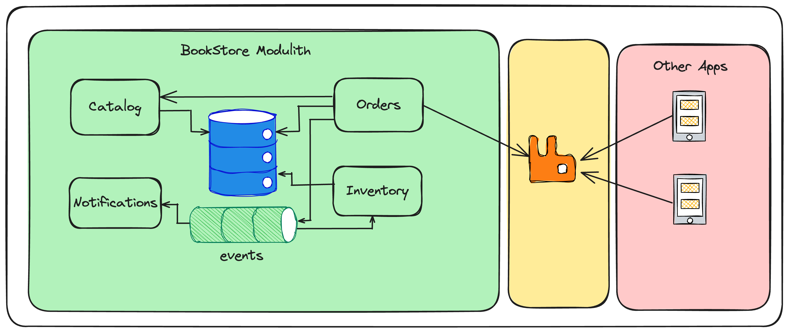

# spring-modular-monolith
An e-commerce application following Modular Monolith architecture using [Spring Modulith](https://spring.io/projects/spring-modulith).
The goal of this application is to demonstrate various features of Spring Modulith with a practical application.



This application follows modular monolith architecture with the following modules:

* **Common:** This module contains the code that is shared by all modules.
* **Catalog:** This module manages the catalog of products and store data in `catalog` schema.
* **Orders:** This module implements the order management and store the data in `orders` schema.
* **Inventory:** This module implements the inventory management and store the data in `inventory` schema.
* **Notifications:** This module handles the events published by other modules and sends notifications to the interested parties.

**Goals:**
* Implement each module as independently as possible.
* Prefer event-driven communication instead of direct module dependency wherever applicable.
* Store data managed by each module in an isolated manner by using different schema or database.
* Each module should be testable by loading only module-specific components.

**Module communication:**

* **Common** module is an OPEN module that can be used by other modules.
* **Orders** module invokes the **Catalog** module public API to validate the order details
* When an Order is successfully created, **Orders** module publishes **"OrderCreatedEvent"**
* The **"OrderCreatedEvent"** will also be published to external broker like RabbitMQ. Other applications may consume and process those events.
* **Inventory** module consumes "OrderCreatedEvent" and updates the stock level for the products.
* **Notifications** module consumes "OrderCreatedEvent" and sends an order confirmation email to the customer.

## Prerequisites
* JDK 24
* Docker and Docker Compose
* Your favourite IDE (Recommended: [IntelliJ IDEA](https://www.jetbrains.com/idea/))

Install JDK, Maven, Gradle, etc using [SDKMAN](https://sdkman.io/)

```shell
$ curl -s "https://get.sdkman.io" | bash
$ source "$HOME/.sdkman/bin/sdkman-init.sh"
$ sdk install java 24.0.1-tem
$ sdk install maven
```

Task is a task runner that we can use to run any arbitrary commands in easier way.

```shell
$ brew install go-task
(or)
$ go install github.com/go-task/task/v3/cmd/task@latest
```

On Linux you can install `task` using your package manager or via `go install`:

```shell
# Debian/Ubuntu (using apt via the official binary repo):
sudo sh -c "wget -qO - https://taskfile.dev/install.sh | bash"

# or using snap (if available):
sudo snap install task --classic

# or build from source with Go:
go install github.com/go-task/task/v3/cmd/task@latest
```

On Windows you can use Chocolatey, Scoop, or `go install`:

```powershell
# Chocolatey
choco install gotask -y

# Scoop
scoop install task

# or build from source with Go (requires Go installed and in PATH):
go install github.com/go-task/task/v3/cmd/task@latest
```

Verify the prerequisites

```shell
$ java -version
$ docker info
$ docker compose version
$ task --version
```

## Using `task` to perform various tasks:

```shell
# Run tests
$ task test

# Automatically format code using spotless-maven-plugin
$ task format

# Build docker image
$ task build_image

# Run application in docker container
$ task start
$ task stop
$ task restart
```

* Application URL: http://localhost:8080
* Actuator URL: http://localhost:8080/actuator
* Actuator URL for modulith: http://localhost:8080/actuator/modulith
* RabbitMQ Admin URL: http://localhost:15672 (Credentials: guest/guest)
* Zipkin URL: http://localhost:9411

## Deploying on k8s cluster
* [Install kubectl](https://kubernetes.io/docs/tasks/tools/)
* [Install kind](https://kind.sigs.k8s.io/docs/user/quick-start/)

```shell
$ brew install kubectl
$ brew install kind
```

Create a KinD cluster and deploy an app.

```shell
# Create KinD cluster
$ task kind_create

# deploy app to kind cluster 
$ task k8s_deploy

# undeploy app
$ task k8s_undeploy

# Destroy KinD cluster
$ task kind_destroy
```

* Application URL: http://localhost:30090
* RabbitMQ Admin URL: http://localhost:30091 (Credentials: guest/guest)
* Zipkin URL: http://localhost:30092

### Kubernetes Deployment Notes and Troubleshooting

These notes explain how `task kind_create` / `task k8s_deploy` behave and common troubleshooting steps you can use when deploying the app to a local KinD cluster.

- Host-port mappings and fallback:
    - The Kind configuration (`k8s/kind/kind-config.yml`) maps host ports (80, 443, 30090-30092) into the control-plane node so services are accessible from the host.
    - If any of those host ports are already in use on your machine (for example a local web server or another Kubernetes runtime), the PowerShell and shell helpers will detect the conflict and create the Kind cluster without hostPort mappings.
    - When host-port mappings are skipped, the app is still deployed inside the cluster — you'll need to port-forward or use `kubectl port-forward` (or access services via the cluster network) to reach them from your host.

- Postgres readiness and app startup:
    - The application depends on the Postgres pod becoming Ready before it can run Flyway migrations and bring up the Spring Boot application.
    - Sometimes the app starts before Postgres finishes initialization, which causes connection errors and a crash loop. In this setup the app will typically retry on pod restart (and succeed) once Postgres is Ready.
    - If the app repeatedly fails with messages like `Connection to spring-modular-monolith-postgres-svc:5432 refused`, check the Postgres pod logs (see commands below) and ensure it reaches `database system is ready to accept connections`.

- Quick troubleshooting commands
    - Show pods and their status:
        - `kubectl get pods -A -o wide`
    - Show the nodes
        - `kubectl get nodes`
    - Describe a failing pod to see events:
        - `kubectl describe pod <pod-name> -n <namespace>`
    - Show logs for a container (current + previous):
        - `kubectl logs <pod-name> -c <container-name>`
        - `kubectl logs <pod-name> -c <container-name> --previous`
    - If Postgres is not Ready, inspect its logs:
        - `kubectl logs <postgres-pod-name> -c postgres`
    - If hostPort mappings were skipped and you want to access the app locally:
        - Port-forward the service to localhost: `kubectl port-forward svc/spring-modular-monolith-svc 8080:8080`
        - Then visit: `http://localhost:8080`

- If you want hostPort mappings enforced
    - Free the host ports (80, 443, 30090-30092) on your machine, or edit `k8s/kind/kind-config.yml` to remove the hostPort entries.
    - Then recreate the cluster with `task kind_destroy` followed by `task kind_create`.

